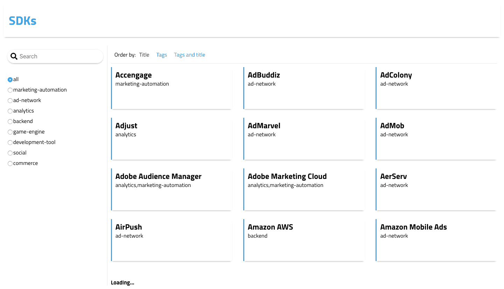
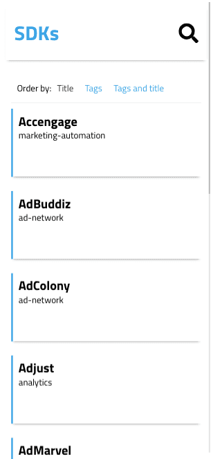
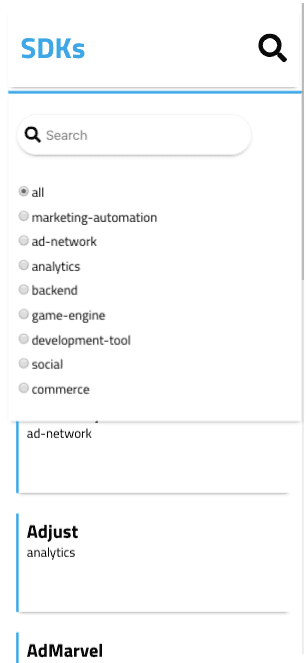

# ReactJS, Angular, Docker, PHP application

Demos located at: 

[ReactJS](http://ec2-18-156-205-114.eu-central-1.compute.amazonaws.com:3001/)  
[Angular 1.6](http://ec2-18-156-205-114.eu-central-1.compute.amazonaws.com:3002/)

### Screenshots

<table width=100%>
  <tr>
    <td>Full Screen</td>
     <td>Mobile</td>
     <td>Mobile with nav open</td>
  </tr>
  <tr>
    <td width=50% height=400px valign=top></td>
    <td width=25% height=400px valign=top></td>
    <td width=25% height=400px valign=top></td>
  </tr>
 </table>

### Production image sizes

| Image    | Size |
| :------- | :--- |
| Frontend | 89MB |
| Angular Frontend | 88MB |
| Backend  | 48MB |

### Running application

  - Start all services ```docker-compose up -d```
  - API is running on http://localhost:3000
  - Frontend is running on http://localhost:3001
  - Angular frontend is running on http://localhost:3002
  - Stop all services ```docker-compose down```

### Development

  - Run backend dev server ```docker-compose -f docker-compose.dev.yml up```
  - Run frontend dev server ```npm start```
 
### Docs

API docs [here](backend/README.md)  
ReactJS frontend docs [here](frontend/README.md)